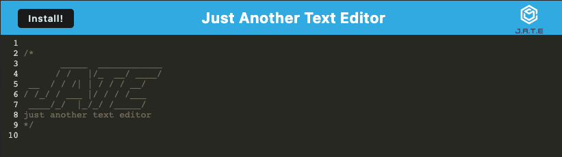
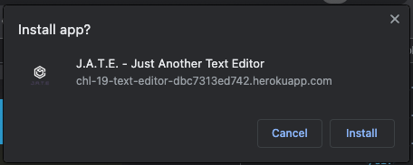
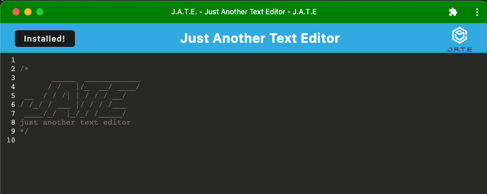
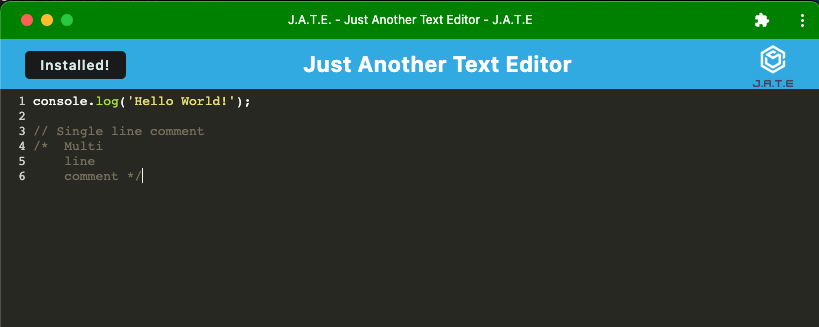
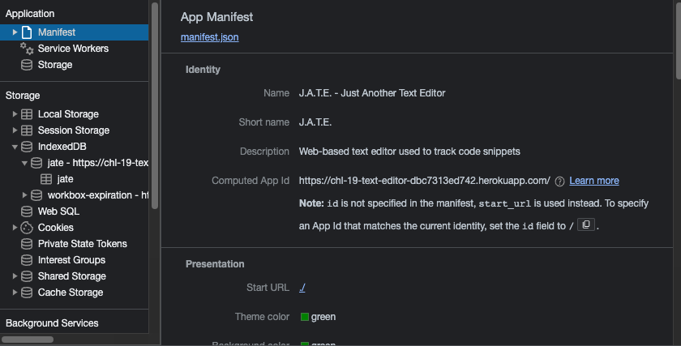
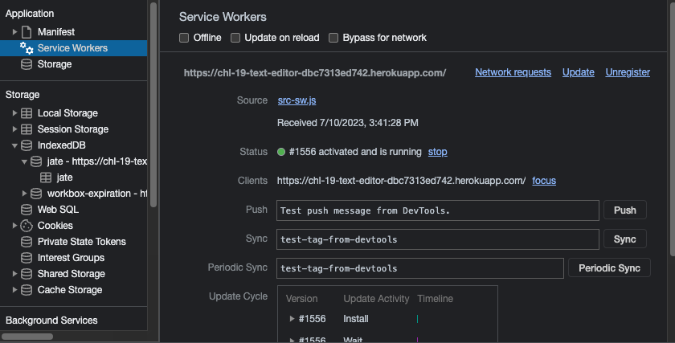
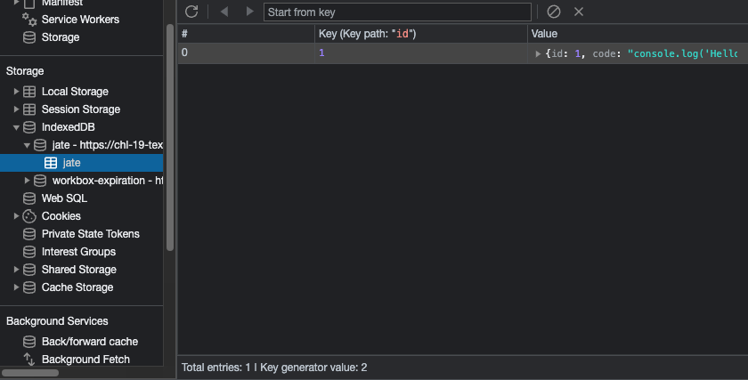
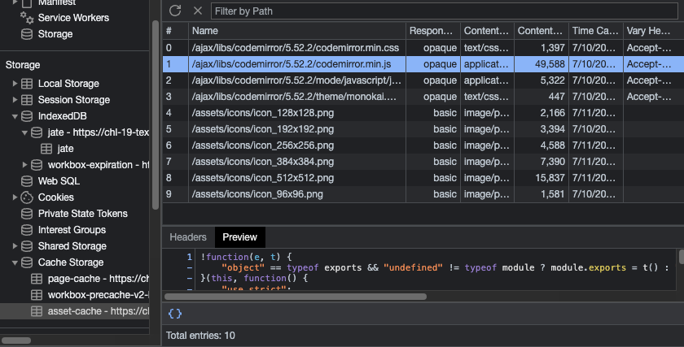

# Challenge 19 - Text Editor

## Project Description

Save your code snippets and refer back to them from your browser or the desktop app, even if you are online from home or on a plane headed somewhere!

This app uses PWA technologies that provide the user a seamless offline experience. It is bundled with Webpack and generates a `manifest.json` file to provide the user with an app installation options. Moreover, the use of a Workbox Service Worker and IndexedDB facilitate offline functionality.

Having succesfully built this app provided me with a lot more understanding of PWAs and Service Workers but I think I still have a lot to learn which I find exciting.

## Table of Contents
- [User Story](#user-story)
- [Acceptance Criteria](#acceptance-criteria)
- [Links](#links)
- [Dependencies](#dependencies)
- [Usage](#usage)
- [Screenshots](#screenshots)

## User Story

```md
AS A developer
I WANT to create notes or code snippets with or without an internet connection
SO THAT I can reliably retrieve them for later use
```

## Acceptance Criteria

```md
GIVEN a text editor web application
WHEN I open my application in my editor
THEN I should see a client server folder structure
WHEN I run `npm run start` from the root directory
THEN I find that my application should start up the backend and serve the client
WHEN I run the text editor application from my terminal
THEN I find that my JavaScript files have been bundled using webpack
WHEN I run my webpack plugins
THEN I find that I have a generated HTML file, service worker, and a manifest file
WHEN I use next-gen JavaScript in my application
THEN I find that the text editor still functions in the browser without errors
WHEN I open the text editor
THEN I find that IndexedDB has immediately created a database storage
WHEN I enter content and subsequently click off of the DOM window
THEN I find that the content in the text editor has been saved with IndexedDB
WHEN I reopen the text editor after closing it
THEN I find that the content in the text editor has been retrieved from our IndexedDB
WHEN I click on the Install button
THEN I download my web application as an icon on my desktop
WHEN I load my web application
THEN I should have a registered service worker using workbox
WHEN I register a service worker
THEN I should have my static assets pre cached upon loading along with subsequent pages and static assets
WHEN I deploy to Heroku
THEN I should have proper build scripts for a webpack application
```
 
## Links

To access the code repository and live website, use the links below:

- ### GitHub Repository URL
    https://github.com/sergiorodriguezdev/chl-19-text-editor 
- ### Heroku App URL
    https://chl-19-text-editor-dbc7313ed742.herokuapp.com/ 

## Dependencies

To install the appropriate dependencies, execute the following command from the repo folder:

```
npm run install
```

## Usage

Clone or download the repo folder to your local machine and install the dependencies as specified in the [Dependencies](#dependencies) section. Then, launch the app using the following command:

```
npm start
```

To access the app, open a web browser and go to `http://localhost:3000`. From here you can install the app by clicking the `Install` button in the upper left corner; once installed, you may launch the app from your desktop. To save the changes in your editor, you have to click outside of the web browser or app window - this will ensure your changes are saved to persistent storage.

You can also deploy the app to your Cloud provider of choice following their documentation.

## Screenshots















